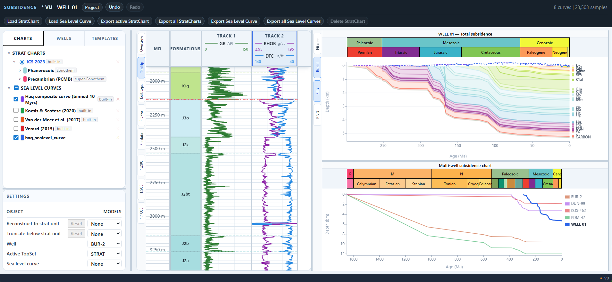

# SUBSIDENCE — 1D burial history and backstripping

## A desktop tool for reconstructing sedimentary basin subsidence from well data

Created by Stepan Vygovskiy

SUBSIDENCE is a local application for 1D burial history analysis and tectonic subsidence / backstripping. It runs entirely on your machine — no cloud, no account required. Import well logs and formation tops, build a stratigraphic framework, assign lithology parameters, and reconstruct how sedimentary layers were buried and compacted through geological time.

Current functionality includes:

- stratigraphic picking directly inside the application
- handling of formation thicknesses, erosional intervals, and hiatuses
- sea-level curve support
- single-well and multi-well subsidence chart comparison
- reconstruction and truncation at selected geological times
- built-in stratigraphic charts
- built-in lithology properties and compaction presets
- support for user-defined sea-level curves, StratCharts, lithologies, and compaction presets

The software is still under active development, but the foundation for future decompaction, tectonic subsidence, and backstripping workflows is already included.

---



---

## Scientific basis

The backstripping and decompaction engine is built on:

- **Athy (1930) exponential porosity-depth model** — decompaction functions adapted from [PyBasin](https://doi.org/10.5281/zenodo.4263427) (Luijendijk, University of Bergen; [doi:10.1029/2010JB008071](https://doi.org/10.1029/2010JB008071))
- **Airy backstripping burial history loop** — algorithm pattern from [Stratya2D](https://github.com/harikrishnannalinakumar/Stratya2D) (Harikrishnan Nalina Kumar)
- **Sea level curves** — Haq composite, Van der Meer et al. (2017), Kocsis & Scotese (2020), Verard (2015); binned data from [Kocsis & Scotese (2022)](https://doi.org/10.1016/j.palaeo.2022.111176), *Palaeogeography, Palaeoclimatology, Palaeoecology*
- **Lithology SVG patterns** — [Equinor lithology-patterns](https://github.com/equinor/lithology-patterns) (MIT)

Reference implementations are in `repos/`.

---

## Getting started

See **[INSTALL.md](INSTALL.md)** for full setup instructions (Python venv + npm).

---

## Running the app

**Terminal 1 — backend:**

```powershell
# Windows
.\.venv\Scripts\Activate.ps1
$env:PYTHONPATH = "$PWD\app\src"
uvicorn subsidence.api.main:app --host 127.0.0.1 --port 8000
```

**Terminal 2 — frontend:**

```bash
cd frontend
npm run dev -- --host 127.0.0.1
```

Open **[http://127.0.0.1:5173](http://127.0.0.1:5173)** in a browser.

---

## How it works

1. **Create or open a project** — stored as a `.subsidence` folder on disk (SQLite + Parquet files).
2. **Import well data** — LAS log curves, formation tops (CSV), deviation surveys.
3. **Build a stratigraphic framework** — create a shared marker set (TopSet) with named horizons; optionally link to a regional stratigraphic chart.
4. **Configure zones** — assign lithology fractions and compaction model parameters (porosity, grain density, compaction coefficient) per stratigraphic zone.
5. **Run backstripping** — the engine decompacts each zone, removes water and sediment load, and reconstructs tectonic subsidence through geological time.
6. **Explore results** — view burial and subsidence curves per well, or compare across multiple wells on a shared age axis.

---

## Known issues and development status

Active bugs and open work items are tracked in [`docs/contracts/`](docs/contracts/).  

---

## Authors and acknowledgements

**Stepan Vygovskiy** — conception, design, and development.

Built with [Claude](https://claude.ai) (Anthropic) and [Codex](https://openai.com/codex) (OpenAI).

Free to use for scientific and commercial purposes — see [LICENSE](LICENSE).

---

## Documentation

- [Architecture overview](docs/architecture.md)
- [Codebase map](docs/codebase-map.md)
- [Documentation index](docs/documentation-index.md)
- Backend source: `app/src/subsidence`
- Frontend source: `frontend/src`
